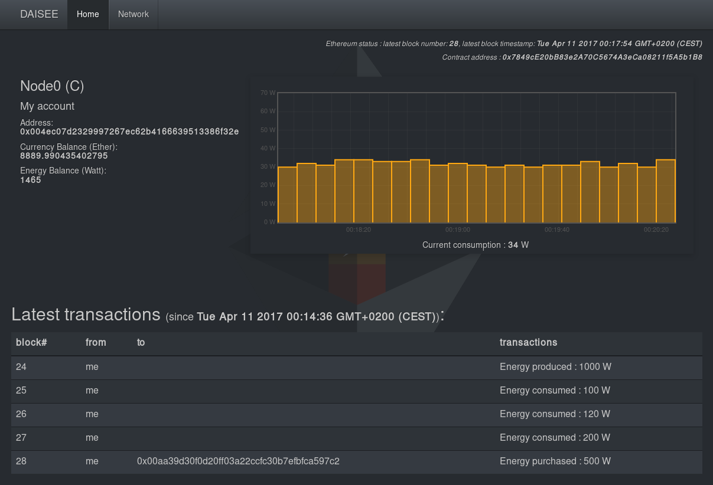

# DApp-v2

Prototype for a decentralized application on a private blockchain (Ethereum).   
_Work in progress ([proto v0.2](https://github.com/DAISEE/Prototypes#prototype-v02))_  
 

Sources: 
* [The proto-documentation of the DAISEE Dapp (in French)](https://hackpad.com/DAISEE-Design-Deploy-App-sTLyhw9iOaO)
* [A simple smart contract Web UI using web3.js](http://hypernephelist.com/2016/06/21/a-simple-smart-contract-ui-web3.html)
* [Dashboard to visualize the activity in the SolarChain network](https://github.com/tomconte/solarchain-dashboard)
* [Create your own crypto-currency with Ethereum](https://www.ethereum.org/token)
